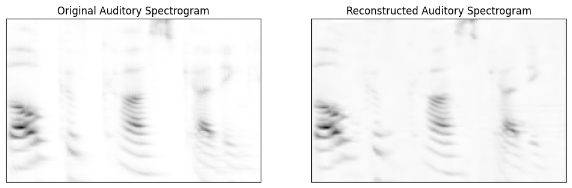

## Case 1

Audio: [Ground Truth](Case1_groundTruth.mp3) vs. [Model Output](Case1_reconstructedAudio.mp3)

## Case 2

Audio: [Ground Truth](Case3_groundTruth.mp3) vs. [Model Output](Case2_reconstructedAudio.mp3)

## Case 3

### White noise removal

Audio: [Noisy Input](Case3_noiseCorrupted.mp3) vs. [Model Output](Case3_modelEnhanced.mp3) vs. [Ground Truth](Case3_groundTruth.mp3)

### Cocktail party (2-speaker) scenario

Audio: [Noisy Input](Case3_cocktail_noiseCorrupted.mp3) vs. [Model Output](Case3_cocktail_modelEnhanced.mp3)
